# Pet Shelter Application
A full-stack pet shelter application with a React frontend and AWS serverless backend.

**DISCLAIMER: This project is proprietary educational content from Amazon Cloud Institute (ACI) and is part of a structured learning program. This code is for educational purposes only and should not be redistributed or used commercially.**


## Project Tree

```
aci-pet-shelter-learning/
│
├── pet-shelter-client/          # React Frontend (Vite)
│   ├── public/
│   ├── src/
│   │   ├── assets/              # Images & static files
│   │   ├── components/
│   │   │   ├── Home.jsx
│   │   │   ├── Header.jsx
│   │   │   ├── Footer.jsx
│   │   │   ├── AboutUs.jsx
│   │   │   ├── Pets.jsx
│   │   │   ├── AdoptionForm.jsx
│   │   │   ├── Applications.jsx
│   │   │   └── ApplicationDetail.jsx
│   │   ├── App.jsx
│   │   └── main.jsx
│   ├── .env
│   ├── package.json
│   └── vite.config.js
│
└── pets-backend-working/        # AWS SAM Serverless Backend (Python)
    ├── handlers/
    │   ├── get_pets/            → GET /pets
    │   ├── create_adoption/     → POST /adoptions
    │   ├── get_adoption/        → GET /adoptions/{id}
    │   ├── get_adoptions/       → GET /adoptions
    │   ├── generate_presigned_url/ → S3 image upload
    │   ├── create_report/       → trigger report generation
    │   ├── generate_report_data/
    │   └── generate_html/       → HTML report rendering
    ├── scripts/                 # DB seeding & S3 bucket setup
    ├── template.yaml            # SAM infrastructure definition
    └── samconfig.toml           # SAM deploy config

    Key relationships:

The React frontend calls the Lambda handlers via API Gateway

DynamoDB stores pets, adoptions, and interest data

S3 handles pet images (via presigned URLs) and generated reports

SAM (template.yaml) defines and deploys all backend infrastructure
```

## Architecture


## Project Structure

- `pet-shelter-client/` - React frontend application
- `pets-backend-working/` - AWS SAM serverless backend

## Frontend (pet-shelter-client)

React application built with Vite for managing pet adoptions.

### Running the React frontend application
```bash
cd pet-shelter-client
npm install
npm run dev
```


 Access the frontend application by following the link at the right of  ➜  Local:

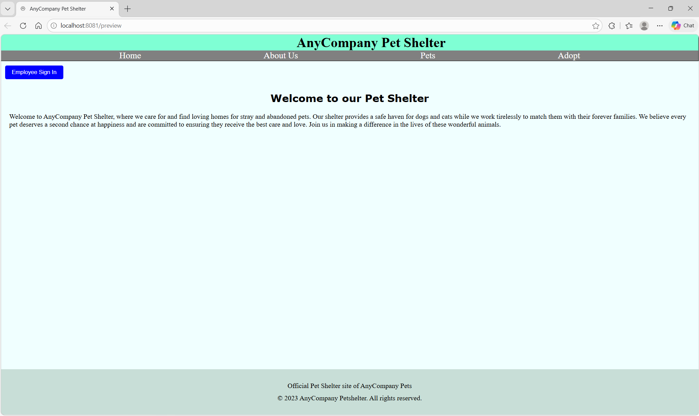

Creating S3 bucket and uploading pictures from aci-pet-shelter-learning/src/assets to the bucket
```bash
cd pets-backend-working/scripts
python create_images_bucket.py
```
This creates an S3 bucket in your AWS account where pictures from your computer are uploaded. Make a copy of the bucket url.

### Creating the .env file
```bash
cd pet-shelter-client
cp .env.example .env
``` 
Open the .env file and paste the bucket url you copied in the previous step as the value for VITE_S3_BUCKET_URL. This allows the frontend to access the images stored in the S3 bucket.
Also replace the VITE_REDIRECT_URI with the React frontend url. It should be the url next to -> Local obtained in a previous step
 After refreshing the React frontend page, this is how the home page looks like:

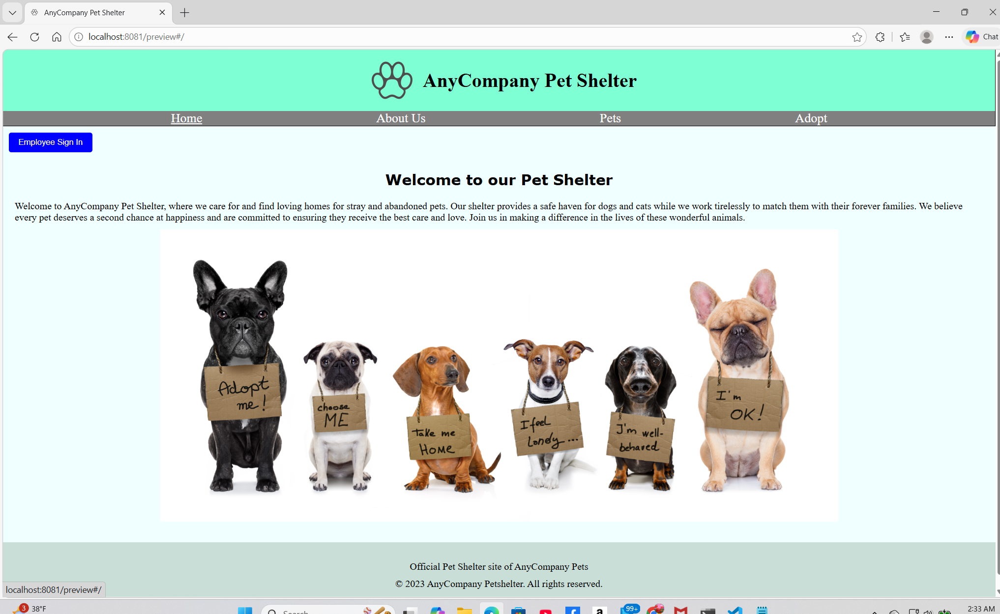

And this is how the About Us page looks like:

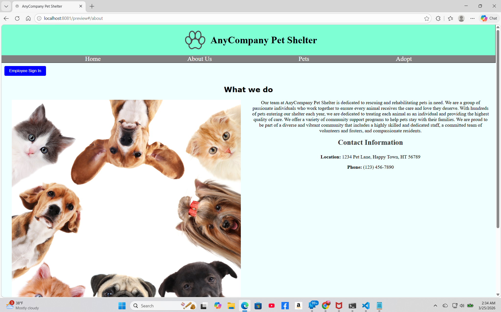

Before deploying the backend we need the report-bucket name where the reports generated by the employees of the shelter will be uploaded
```bash
cd pets-backend-working/scripts
python create_report_bucket.py
```
This creates an S3 bucket in your AWS account where generated reports are uploaded. Make a copy of the bucket url. We will need it when deploying the backend.


## Backend (pets-backend-working)

AWS SAM application with Lambda functions for pet and adoption management.

### Setup
```bash
cd pets-backend-working
sam build
sam deploy --guided
```
Stack Name []: Give a name to your app

AWS Region []: Choose the region where you want to deploy your app

Report Bucket Name []: Paste the bucket url you copied in the previous step

Parameter SNSEmailEndpoint []: Enter an email that you have access to

Parameter CognitoCallbackURL [http://localhost:8081/preview]: Accept the default value. It should match the one from the React frontend

#Shows you resources changes to be deployed and require a 'Y' to initiate deploy
Confirm changes before deploy [y/N]:

Allow SAM CLI to create IAM roles with the required permissions [Y/n]: Y

#Preserves the state of previously provisioned resources when an operation fails
Disable rollback [y/N]:N

Save arguments to configuration file [Y/n]: Y

SAM configuration file [samconfig.toml]: Accept the default value

SAM configuration environment [default]: Accept the default value

### Updating the .env file
Use the following outputs from the AWS SAM deployment to update the variables in the **.env** file:
- Update **VITE_API_GATEWAY_URL** with the PetsAPI prod stage URL from the AWS SAM deployment outputs
- Update the **VITE_CLIENT_ID** with the output value for **CognitoUserPoolClientId** from the AWS SAM 
- At the top of the AWS Management Console, search for and select `Cognito
- On the Cognito page, choose **pets-app** user pool.
- On the sidebar, choose **App Clients** , and then choose **pets-app-client**.
- Choose **Login pages**, and then choose **View login page** and copy the URL from the beginning through *.com*. Do not copy any additional characters. The copied URL should be similar to the following:
https://pets-app-user-pool-123345689102.auth.us-east-1.amazoncognito.com
- Update the **VITE_COGNITO_AUTH_URL** with the URL you just copied. 


Also check your mailbox for AWS Notification-Subscription Confirmation and confirm subscription to later receive reports generated by employees.

### Populate the DynamoDB tables
```bash
cd pets-backend-working/scripts
python populate_pets_table.py
python populate_interests_table.py
python populate_adoptions_table.py
```
This is how the Pets homepage, Adopt homepage and employee signing homepage look like:
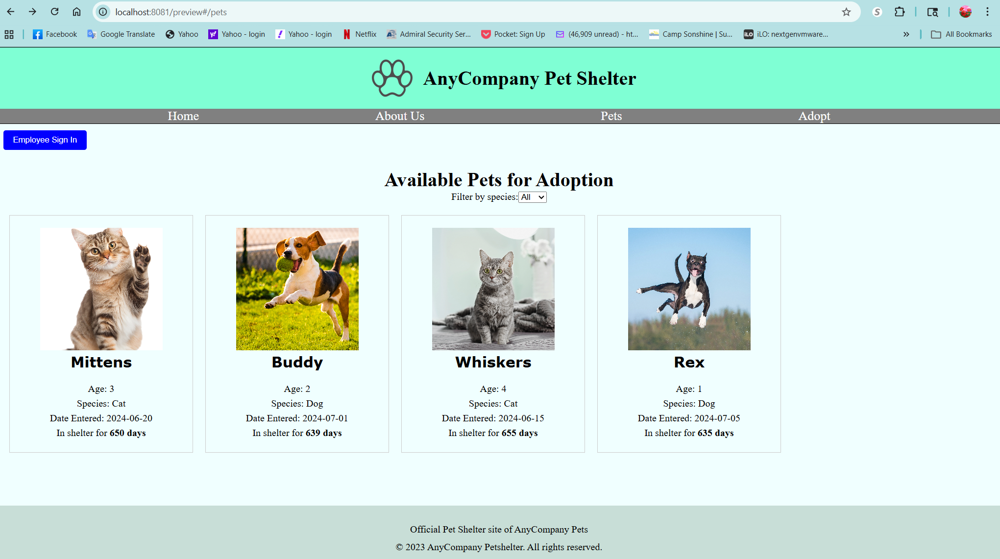
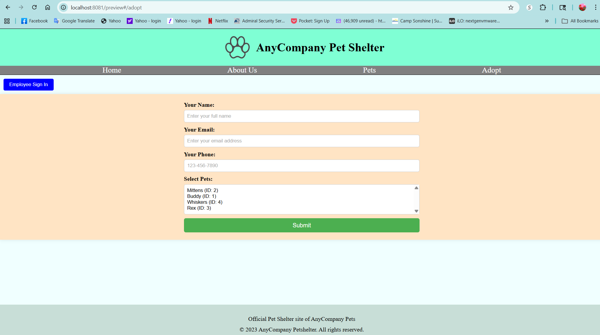
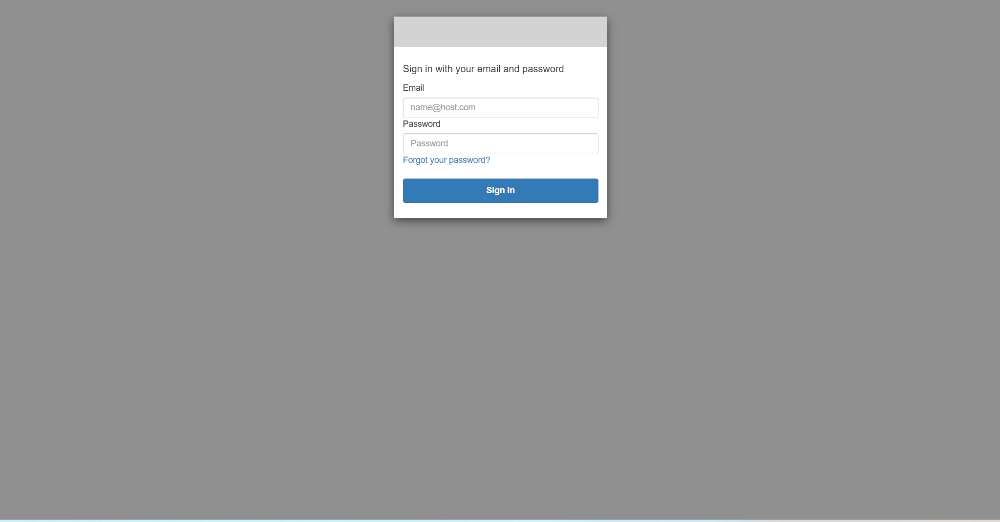

### Test the employee signing and the generating button features
1. Create a user in Amazon Cognito
- Open AWS Management Console, search for and choose Cognito
- Navigate to the User pools page and choose pets-app.
- In the left navigation pane, under User management, choose Users.
- Choose Create user.
- Choose don't send invitation and choose set a password.
- Enter an email, such as firstname_lastname@example.com, and select Mark email address as verified. For Temporary password, choose a temporary password, such as the straightforward (and very weak) Password1!. Remember your password or record it somewhere so you can use it to log in later.

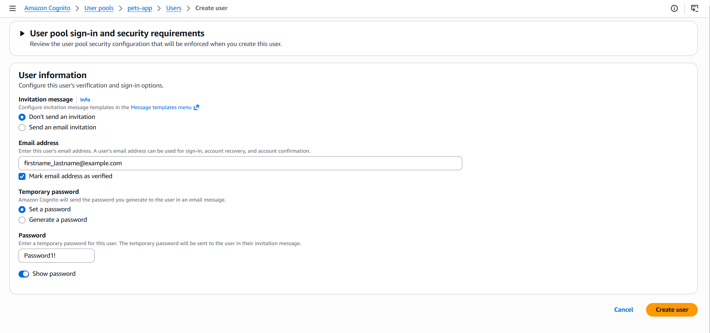

- Leave the other options as defaults and choose Create user.

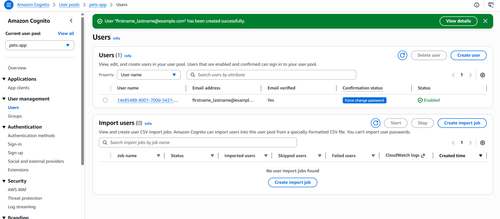

- Open the website preview, and choose Employee login.


- Enter the email and password that you just created.

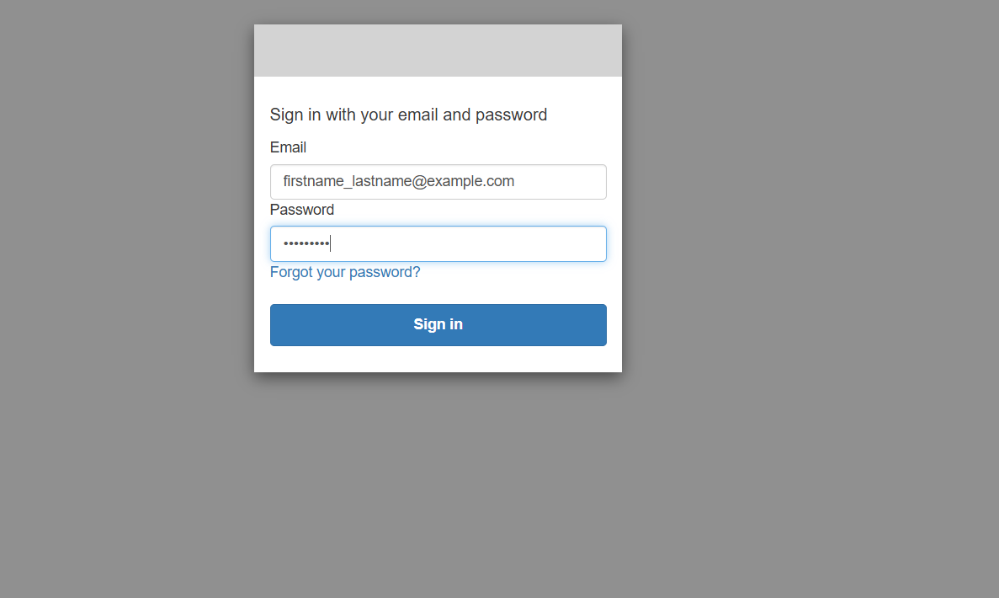

- If you successfully log in, you will be prompted to change your password. Enter a new password of your choice. Save your password in a note or text file so you can refer to it, if needed.

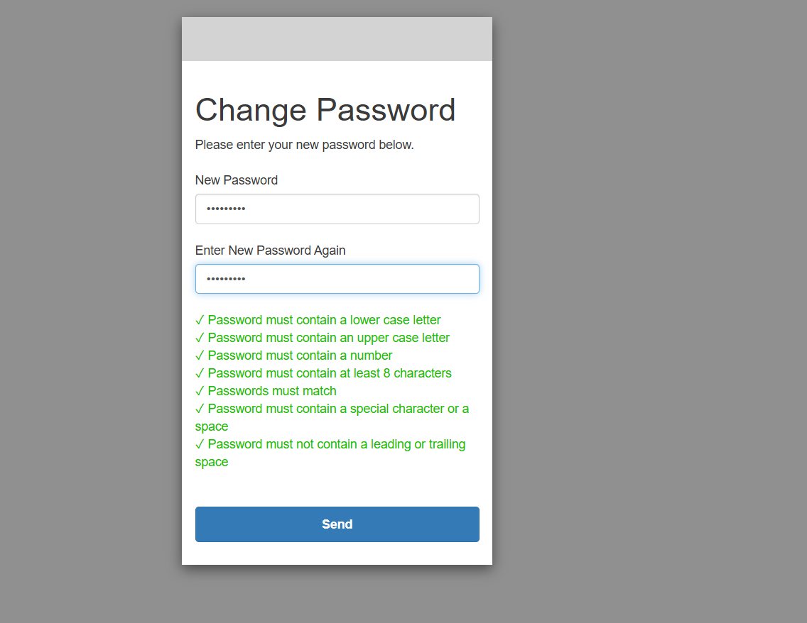

    When you enter your new password, you should be redirected back to the AnyCompany Pet Shelter website. There should now be a message at the top of the page that states, Signed in as employee. The Employee sign in button should be a Sign Out button, and the Applications link should be included in the top navigation bar, as shown in the image.

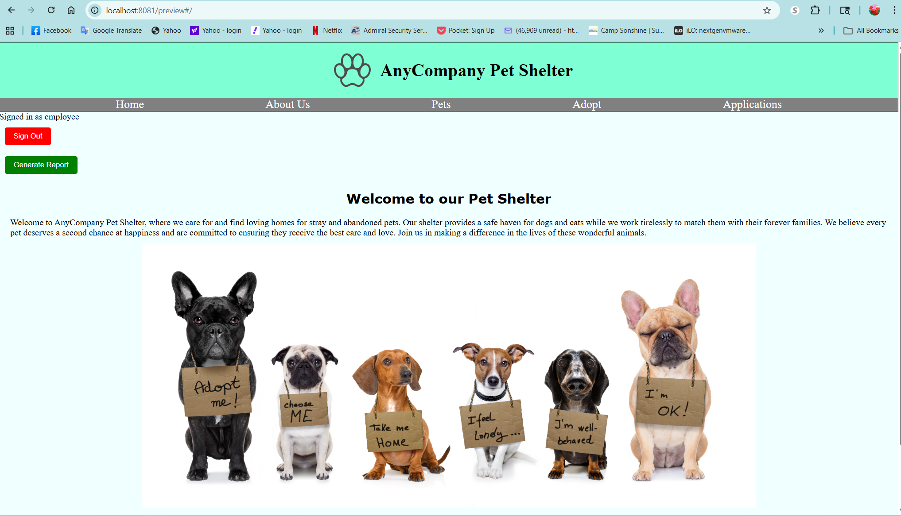

2. Generate a report
- After signing in as an employee, choose the Generate Report.

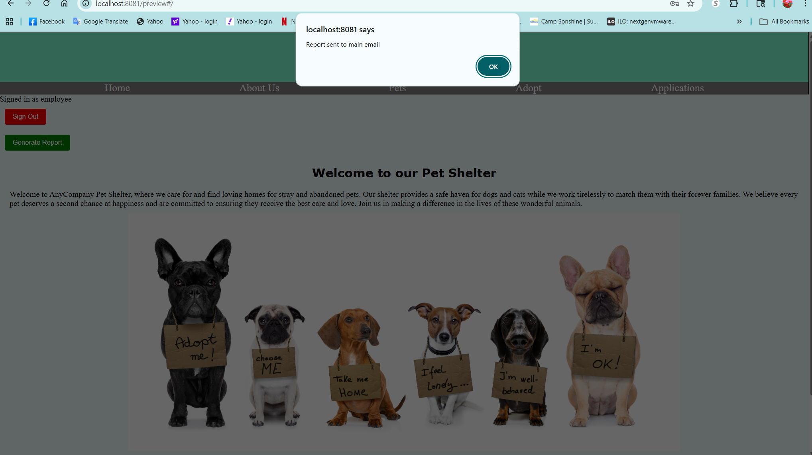

- After a few minutes you should see a link to the report in your mailbox.
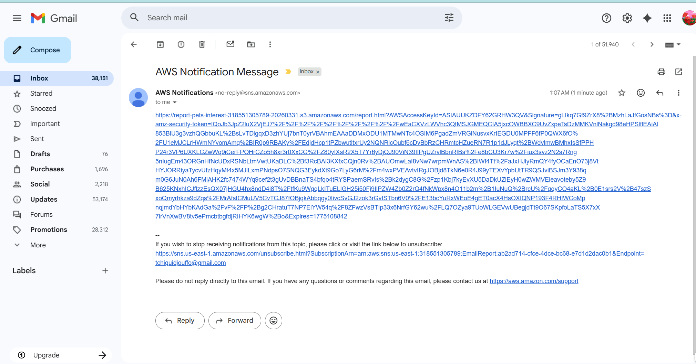


## Features

- Pet listing and management
- Adoption application system
- Report generation
- Image management with S3

## Technologies

- Frontend: React, Vite
- Backend: AWS Lambda, DynamoDB, S3
- Infrastructure: AWS SAM